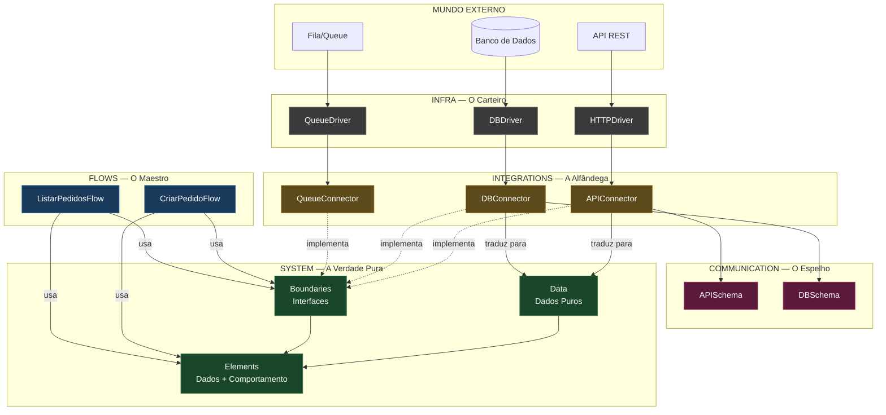

# AOF---Arquitetura-Orientada-a-Fronteira
Arquitetura Orientada a Fronteiras — Uma arquitetura de software que organiza o código por suas fronteiras naturais: domínio puro, tradução e transporte. Inspirada em DDD e Arquitetura Hexagonal.

# Arquitetura Orientada a Fronteiras

> **"O software deve saber o que é, mas não onde está."**

## Manifesto

Por **João Marcus da Costa Brandão** — Ceará, Brasil

---

## 1. Origens e Filosofia

A **Arquitetura Orientada a Fronteiras** nasce de uma convicção simples, porém poderosa: **todo software possui fronteiras**. Fronteiras entre o que é puro e o que é externo, entre o que é regra de negócio e o que é transporte de dados, entre o que o sistema *é* e o que o sistema *precisa do mundo*.

Esta arquitetura tem suas raízes profundas em dois pilares consolidados da engenharia de software:

- **Domain-Driven Design (DDD)** — de Eric Evans, que nos ensinou que o domínio é o coração e que devemos modelar o software a partir da realidade do negócio, não das tecnologias que o cercam.
- **Hexagonal Architecture (Ports & Adapters)** — de Alistair Cockburn, que nos mostrou que o software deve ser independente de suas entregas e dispositivos, e que toda comunicação com o exterior deve passar por portas bem definidas.

No entanto, a Arquitetura Orientada a Fronteiras se constrói a partir dessas bases, reorganizando seus conceito. Ela **refina, renomeia e reorganiza** os conceitos para criar um modelo mental mais explícito e orientado à prática. Cada camada ganha uma identidade clara e uma responsabilidade inegociável. Cada regra de dependência existe por uma razão concreta. Buscando equilíbrio entre abstração e aplicabilidade prática.

A premissa central é: **o software deve ser organizado pelas suas fronteiras naturais**, não por padrões impostos pelo framework, pelo banco de dados ou pela API externa. Quando você olha para um projeto construído com esta arquitetura, você não vê "controllers", "repositories" ou "services" espalhados sem critério. Você vê **fronteiras claras** entre o que é puro, o que é tradução e o que é transporte.

---

## 2. As Cinco Fronteiras

A arquitetura define cinco camadas, cada uma com uma metáfora, uma responsabilidade e uma regra de ouro. Essas camadas formam um espectro que vai do mais puro (o domínio) até o mais bruto (o I/O físico).

```
┌─────────────────────────────────────────────────────────────────┐
│                         FLOWS (O Maestro)                      │
│              Comportamentos puros, sem dados internos           │
├─────────────────────────────────────────────────────────────────┤
│                        SYSTEM (A Verdade)                       │
│   Data · Elements · Boundaries — O núcleo isolado do mundo       │
├─────────────────────────────────────────────────────────────────┤
│              INTEGRATIONS (A Alfândega — Connectors)            │
│     Tradutores entre o mundo exterior e o núcleo do sistema     │
├─────────────────────────────────────────────────────────────────┤
│                   COMMUNICATION (O Espelho Estrangeiro)          │
│         Schemas que espelham o formato exato do exterior        │
├─────────────────────────────────────────────────────────────────┤
│                      INFRA (O Carteiro)                         │
│           Drivers burros de I/O — só transportam bytes           │
└─────────────────────────────────────────────────────────────────┘
```

---

### 2.1 System — A Verdade Pura

> *"O coração do software. Onde mora o domínio."*

**System** é a camada mais sagrada da arquitetura. É aqui que vive tudo aquilo que o sistema **é**. Não o que ele consome, não o que ele entrega, não o que ele transporta — aquilo que ele *é*.

Dentro de System existem três tipos fundamentais de construção:

#### Data (Estruturas de Dados Puras)

São as estruturas de dados que representam conceitos do domínio. Não possuem tags de serialização (JSON, XML, YAML). Não importam pacotes externos. Não conhecem o mundo exterior. São tipos puros, limpos, prontos para serem usados internamente pelo sistema sem nenhum acoplamento.

```go
// Exemplo em Go — System/Data
type StatusPedido struct {
    Valor StatusPedidoValor
}

type StatusPedidoValor int

const (
    StatusPendente  StatusPedidoValor = iota
    StatusConfirmado
    StatusCancelado
)
```

```typescript
// Exemplo em TypeScript — System/Data
enum StatusPedido {
  Pendente = "pendente",
  Confirmado = "confirmado",
  Cancelado = "cancelado",
}
```

**Regra de ouro:** Se a estrutura possui um decorator `@JsonProperty`, uma tag `json:""`, ou qualquer anotação de serialização externa, ela não pertence ao System. Ela pertence ao Communication.

#### Elements (Representação com Dados e Comportamentos)

Elements são construções que unem **dados e comportamentos** com regras próprias. São as entidades ricas do domínio, os value objects com lógica encapsulada, os agregados que garantem invariantes. Um Element possui estado interno e expõe comportamentos que operam sobre esse estado, sempre respeitando as regras do domínio.

A diferença fundamental entre Data e Element é que **Data é apenas estrutura** — pode ser validada externamente, mas não carrega lógica. **Element é vivo** — sabe se validar, sabe se transformar, sabe aplicar regras de negócio.

```go
// Exemplo em Go — System/Element
type Pedido struct {
    ID        PedidoID
    Items     []ItemPedido
    Status    StatusPedido
    CriadoEm  time.Time
}

// Comportamento encapsulado — o Element protege suas invariantes
func (p *Pedido) AdicionarItem(item ItemPedido) error {
    if p.Status != StatusPendente {
        return errors.New("não é possível adicionar itens a um pedido já confirmado")
    }
    if len(p.Items) >= 50 {
        return errors.New("limite máximo de itens por pedido atingido")
    }
    p.Items = append(p.Items, item)
    return nil
}

func (p *Pedido) Confirmar() error {
    if len(p.Items) == 0 {
        return errors.New("não é possível confirmar pedido sem itens")
    }
    if p.Status != StatusPendente {
        return errors.New("pedido já está em outro estado")
    }
    p.Status = StatusConfirmado
    return nil
}

func (p *Pedido) Total() float64 {
    var total float64
    for _, item := range p.Items {
        total += item.Preco * float64(item.Quantidade)
    }
    return total
}
```

```typescript
// Exemplo em TypeScript — System/Element
export class Pedido {
  private constructor(
    public readonly id: PedidoID,
    private itens: ItemPedido[],
    private status: StatusPedido,
    public readonly criadoEm: Date,
  ) {}

  adicionarItem(item: ItemPedido): Resultado<void> {
    if (this.status !== StatusPedido.Pendente) {
      return Resultado.erro("Não é possível adicionar itens a um pedido já confirmado");
    }
    if (this.itens.length >= 50) {
      return Resultado.erro("Limite máximo de itens por pedido atingido");
    }
    this.itens.push(item);
    return Resultado.sucesso();
  }

  confirmar(): Resultado<void> {
    if (this.itens.length === 0) {
      return Resultado.erro("Não é possível confirmar pedido sem itens");
    }
    if (this.status !== StatusPedido.Pendente) {
      return Resultado.erro("Pedido já está em outro estado");
    }
    this.status = StatusPedido.Confirmado;
    return Resultado.sucesso();
  }

  total(): number {
    return this.itens.reduce(
      (acc, item) => acc + item.preco * item.quantidade, 0
    );
  }
}
```

**Regra de ouro:** Um Element nunca importa nada de Communication, Infra ou Integrations. Ele só conhece a si mesmo e outros tipos do System.

#### Boundaries (Contratos de Fronteira)

Boundaries são as interfaces (contracts) que definem **o que o System precisa do mundo exterior**, mas nunca *como* obter. Eles representam as fronteiras do domínio — os pontos de contato onde o System reconhece que existe algo além de si mesmo, mas se recusa a saber o que é.

Aqui fica clara a inspiração no conceito clássico de **Ports** da Arquitetura Hexagonal. O nome "Boundary" reforça a metáfora central desta arquitetura: são **fronteiras** entre o que é puro e o que é externo.

```go
// Exemplo em Go — System/Boundary
type BuscadorDeCliente interface {
    BuscarPorID(id ClienteID) (Cliente, error)
}

type RepositorioDePedido interface {
    Salvar(pedido Pedido) error
    BuscarPorID(id PedidoID) (Pedido, error)
}

type NotificadorDePagamento interface {
    NotificarPagamento(pedidoID PedidoID, valor float64) error
}
```

```typescript
// Exemplo em TypeScript — System/Boundary
export interface BuscadorDeCliente {
  buscarPorID(id: ClienteID): Promise<Resultado<Cliente>>;
}

export interface RepositorioDePedido {
  salvar(pedido: Pedido): Promise<Resultado<void>>;
  buscarPorID(id: PedidoID): Promise<Resultado<Pedido>>;
}

export interface NotificadorDePagamento {
  notificarPagamento(pedidoID: PedidoID, valor: number): Promise<Resultado<void>>;
}
```

**Regra de ouro:** Um Boundary é definido **dentro do System**, mas é implementado **fora do System** (em Integrations). O System só conhece a interface, nunca a implementação. Ele não sabe que internet, bancos de dados ou APIs terceiras existem.

#### Resumo das Regras do System

| O que PODE              | O que NÃO PODE                  |
|------------------------|---------------------------------|
| Definir tipos puros     | Importar pacotes de HTTP, DB    |
| Ter comportamentos     | Ter tags de serialização (JSON) |
| Definir interfaces      | Conhecer implementações         |
| Conter regras de negócio | Importar Communication, Infra ou Integrations |

---

### 2.2 Communication — O Espelho Estrangeiro

> *"O contrato de fronteira. Onde mora a forma como o mundo exterior fala."*

**Communication** é a camada onde vivem as estruturas que **espelham milimetricamente** o formato de dados do mundo exterior. Se uma API retorna um JSON com camelCase, é aqui que vive a struct/interface com camelCase. Se a API manda um campo `created_at` como string ISO 8601, é aqui que ele existe como string.

Esta camada não tem absolutamente nenhum comportamento de negócio. Ela é **apenas o molde do dado estrangeiro**. Pode (e deve) conter tags de validação, serialização e deserialização, pois sua função é representar fielmente o formato externo.

```go
// Exemplo em Go — Communication/Schema
type PedidoResponseAPI struct {
    ID          string `json:"id"`
    CustomerID  string `json:"customer_id"`
    Status      string `json:"status"`
    TotalAmount string `json:"total_amount"`
    CreatedAt   string `json:"created_at"`
    Items       []ItemResponseAPI `json:"items"`
}

type ItemResponseAPI struct {
    ProductID   string `json:"product_id"`
    Quantity     int    `json:"quantity"`
    UnitPrice    string `json:"unit_price"`
}
```

```typescript
// Exemplo em TypeScript — Communication/Schema
export interface PedidoResponseAPI {
  id: string;
  customer_id: string;
  status: string;
  total_amount: string;
  created_at: string;
  items: ItemResponseAPI[];
}
```

**Regra de ouro:** Communication não tem comportamento. Se você precisa de uma função que converta `total_amount` de string para float64, essa função não pertence ao Communication — pertence ao Connector em Integrations.

#### O Porquê da Existência

Communication existe por uma razão pragmática: o formato externo **muda independentemente** do formato interno. Hoje a API manda `total_amount` como string. Amanhã pode mandar como número. Se o seu System estivesse acoplado ao formato da API, toda mudança externa exigiria mudança no domínio. Com Communication, a mudança só afeta o Connector que faz a tradução.

É a separação entre **o que o mundo fala** (Communication) e **o que o sistema entende** (System).

---

### 2.3 Infra — O Carteiro

> *"A execução física. O transporte puro de dados."*

**Infra** é a camada mais burra e mais honesta da arquitetura. Aqui vivem os **drivers** — funções puras de input/output que recebem e devolvem tipos primitivos. `string`, `[]byte`, `int`, `status codes`. Nada mais.

O Infra não sabe o que o dado significa. Não faz parseamento de negócio. Não converte string em booleano. Não valida regras. Ele apenas **transporta**.

```go
// Exemplo em Go — Infra/Driver
type HTTPDriver interface {
    Get(url string, headers map[string]string) ([]byte, int, error)
    Post(url string, body []byte, headers map[string]string) ([]byte, int, error)
}

type DatabaseDriver interface {
    Query(sql string, args ...any) ([][]string, error)
    Exec(sql string, args ...any) error
}
```

```typescript
// Exemplo em TypeScript — Infra/Driver
export interface HTTPDriver {
  get(url: string, headers: Record<string, string>): Promise<{ body: string; status: number }>;
  post(url: string, body: string, headers: Record<string, string>): Promise<{ body: string; status: number }>;
}
```

**Regra de ouro:** Se o seu driver recebe ou devolve qualquer tipo que não seja primitivo (structs, objetos de domínio, enums), ele não é Infra — é algo que está assumindo responsabilidade que não lhe cabe.

#### Por Que Separar Infra do Connector?

Você pode se perguntar: "Por que não colocar a chamada HTTP direto no Connector?" A resposta é **testabilidade e troca**. Quando o Infra é isolado:

1. Você pode criar um **MockDriver** para testes sem iniciar um servidor HTTP.
2. Você pode trocar o driver de HTTP para gRPC sem tocar em nada além do Infra e do Connector.
3. O Connector foca apenas em traduzir dados, não em lidar com sockets, timeouts e headers.

---

### 2.4 Integrations — A Alfândega (Connectors)

> *"O tradutor entre o Exterior e o Núcleo."*

**Integrations** é a camada onde toda a **conversão semântica** acontece. É aqui que o formato estrangeiro (Communication) se transforma no formato puro do domínio (System), e vice-versa. É a alfândega do sistema: tudo que vem de fora passa por aqui e é inspecionado, traduzido e filtrado antes de entrar no território puro.

O componente principal desta camada é o **Connector**. Um Connector:

1. Implementa um **Boundary** definido no System.
2. Usa o **Infra** para buscar/entregar os bytes brutos do mundo exterior.
3. Faz o **parse** dos bytes para a estrutura de Communication.
4. **Traduz/converte** a estrutura de Communication para os tipos puros do System.
5. Retorna os dados puros para quem chamou (normalmente o Flow).

Esta é a minha concepção do conceito clássico de **Adapter** da Arquitetura Hexagonal. O nome "Connector" deixa explícita a função: **conectar** algo externo ao sistema. E o nome "Integrations" reforça que, se existe um Connector, é porque há algo externo sendo integrado ao núcleo.

```go
// Exemplo em Go — Integrations/Connector
type APIClienteConnector struct {
    driver HTTPDriver
    baseURL string
}

// Implementa o Boundary BuscadorDeCliente definido no System
func (c *APIClienteConnector) BuscarPorID(id ClienteID) (Cliente, error) {
    // 1. Usa o Infra para buscar os bytes
    url := fmt.Sprintf("%s/v1/customers/%s", c.baseURL, id)
    body, statusCode, err := c.driver.Get(url, nil)
    if err != nil {
        return Cliente{}, fmt.Errorf("erro de infra ao buscar cliente: %w", err)
    }
    if statusCode != 200 {
        return Cliente{}, fmt.Errorf("API retornou status %d", statusCode)
    }

    // 2. Faz o parse para Communication (o formato externo)
    var apiResponse schema.ClienteResponseAPI
    if err := json.Unmarshal(body, &apiResponse); err != nil {
        return Cliente{}, fmt.Errorf("erro ao decodificar resposta: %w", err)
    }

    // 3. Traduz Communication → System (conversão semântica)
    clienteID, err := ClienteIDFromString(apiResponse.ID)
    if err != nil {
        return Cliente{}, fmt.Errorf("ID de cliente inválido: %w", err)
    }

    status, err := StatusFromString(apiResponse.Status)
    if err != nil {
        return Cliente{}, fmt.Errorf("status inválido vindo da API: %w", err)
    }

    // Descarta IDs estrangeiros que não fazem sentido para o domínio
    return Cliente{
        ID:     clienteID,
        Nome:   apiResponse.Name,
        Status: status,
    }, nil
}
```

```typescript
// Exemplo em TypeScript — Integrations/Connector
export class APIClienteConnector implements BuscadorDeCliente {
  constructor(private driver: HTTPDriver, private baseURL: string) {}

  async buscarPorID(id: ClienteID): Promise<Resultado<Cliente>> {
    // 1. Usa o Infra para buscar os bytes
    const url = `${this.baseURL}/v1/customers/${id.valor}`;
    const response = await this.driver.get(url, {});

    if (response.status !== 200) {
      return Resultado.erro(`API retornou status ${response.status}`);
    }

    // 2. Faz o parse para Communication (o formato externo)
    const apiResponse: ClienteResponseAPI = JSON.parse(response.body);

    // 3. Traduz Communication → System (conversão semântica)
    const clienteID = ClienteID.criar(apiResponse.id);
    if (clienteID.falhou) {
      return Resultado.erro("ID de cliente inválido: " + clienteID.erro);
    }

    const status = Status.criar(apiResponse.status);
    if (status.falhou) {
      return Resultado.erro("Status inválido vindo da API: " + status.erro);
    }

    return Resultado.sucesso(
      new Cliente(clienteID.valor, apiResponse.name, status.valor)
    );
  }
}
```

**Regra de ouro:**O Connector é o **PRINCIPAL** lugar onde a conversão semântica acontece. Se um campo externo chamado `"is_active"` precisa se tornar um `StatusAtivo` interno, a conversão acontece aqui. Se um ID estrangeiro precisa ser descartado porque não faz sentido para o domínio, ele é descartado aqui.

#### Decisões que só o Connector Toma

| Conversão                                     | Exemplo                                     |
|----------------------------------------------|---------------------------------------------|
| String externa → Enum interno                | `"active"` → `StatusAtivo`                 |
| String numérica → Float com precisão        | `"99.90"` → `float64(99.90)`              |
| Campo existente → Campo ignorado             | API manda `external_ref`, System ignora     |
| Múltiplos campos externos → Um campo interno | `street + number + city` → `Endereco`       |
| Erro externo → Erro de domínio              | HTTP 404 → `ErroClienteNaoEncontrado`      |

---

### 2.5 Flows — O Maestro

> *"Os casos de uso do sistema. Comportamento puro sem dados próprios."*

**Flows** é a camada de orquestração. Aqui moram os **casos de uso** do sistema — os comportamentos que recebem dados externos, coordenam a execução e retornam resultados. Um Flow não possui dados internos próprios; ele é puramente **comportamental**. Ele orquestra a interação entre os Elements do System, usando os Boundaries para acessar o mundo exterior.

A tríade fundamental da arquitetura fica clara aqui:

| Primitivo   | Natureza                       | O que faz                          |
|-------------|-------------------------------|-------------------------------------|
| **Schemas** | Dados sem comportamento        | Estruturam informação               |
| **Elements** | Dados + comportamento       | Representam conceitos com regras    |
| **Flows**   | Comportamento sem dados        | Orquestram processos e casos de uso |

Um Flow nunca importa Connectors ou Infra diretamente. Ele depende **exclusivamente** dos Boundaries (interfaces) definidos no System. Isso garante que o comportamento orquestrado seja testável, isolado e independente de qualquer detalhe de implementação externa.

```go
// Exemplo em Go — Flows/CasoDeUso
type CriarPedidoFlow struct {
    repo      RepositorioDePedido    // Boundary do System
    buscador  BuscadorDeCliente      // Boundary do System
    notifier  NotificadorDePagamento // Boundary do System
}

func (f *CriarPedidoFlow) Executar(cmd CriarPedidoCommand) (Pedido, error) {
    // 1. Busca o cliente usando o Boundary (não sabe de onde vem)
    cliente, err := f.buscador.BuscarPorID(cmd.ClienteID)
    if err != nil {
        return Pedido{}, fmt.Errorf("cliente não encontrado: %w", err)
    }

    // 2. Cria o Element de domínio
    pedido := Pedido{
        ID:       NovoPedidoID(),
        Status:   StatusPendente,
        CriadoEm: time.Now(),
    }

    // 3. Adiciona itens usando o comportamento do Element
    for _, itemCmd := range cmd.Itens {
        item := ItemPedido{
            ProdutoID: itemCmd.ProdutoID,
            Quantidade: itemCmd.Quantidade,
            Preco:      itemCmd.Preco,
        }
        if err := pedido.AdicionarItem(item); err != nil {
            return Pedido{}, err
        }
    }

    // 4. Confirma usando o comportamento do Element
    if err := pedido.Confirmar(); err != nil {
        return Pedido{}, err
    }

    // 5. Salva usando o Boundary (não sabe onde vai)
    if err := f.repo.Salvar(pedido); err != nil {
        return Pedido{}, fmt.Errorf("erro ao salvar pedido: %w", err)
    }

    // 6. Notifica usando o Boundary
    if err := f.notifier.NotificarPagamento(pedido.ID, pedido.Total()); err != nil {
        // Log erro mas não falha o fluxo — decisão de negócio
    }

    return pedido, nil
}
```

```typescript
// Exemplo em TypeScript — Flows/CasoDeUso
export class CriarPedidoFlow {
  constructor(
    private repo: RepositorioDePedido,
    private buscador: BuscadorDeCliente,
    private notifier: NotificadorDePagamento,
  ) {}

  async executar(cmd: CriarPedidoCommand): Promise<Resultado<Pedido>> {
    // 1. Busca o cliente usando o Boundary
    const cliente = await this.buscador.buscarPorID(cmd.clienteID);
    if (cliente.falhou) {
      return Resultado.erro("Cliente não encontrado: " + cliente.erro);
    }

    // 2. Cria o Element de domínio
    const pedido = Pedido.criar(cmd.itens);
    if (pedido.falhou) {
      return Resultado.erro("Falha ao criar pedido: " + pedido.erro);
    }

    // 3. Confirma usando o comportamento do Element
    const confirmacao = pedido.valor.confirmar();
    if (confirmacao.falhou) {
      return Resultado.erro("Falha ao confirmar: " + confirmacao.erro);
    }

    // 4. Salva usando o Boundary
    const salvamento = await this.repo.salvar(pedido.valor);
    if (salvamento.falhou) {
      return Resultado.erro("Erro ao salvar pedido: " + salvamento.erro);
    }

    // 5. Notifica usando o Boundary
    await this.notifier.notificarPagamento(
      pedido.valor.id,
      pedido.valor.total()
    );

    return Resultado.sucesso(pedido.valor);
  }
}
```

**Regra de ouro:** Flows são **camada comportamental**. Eles não têm estado interno. Eles não são "objects" — são **processos**. Recebem dados de entrada, orquestram a lógica e devolvem resultados. Se você precisa de um objeto com estado que vive entre requisições, isso é um **Element** (dentro de System), não um Flow.

---

## 3. O Fluxo da Informação

A informação percorre o sistema em uma linha clara e previsível:

```
Flow → Boundary → Connector → Infra → [bytes] → Infra → Connector → Communication → System
```

Visualmente:

```
  ┌──────────────────────────────────────────────────────────────────┐
  │                        MUNDO EXTERNO                              │
  │                   (API, Banco, File, Queue)                       │
  └──────────────────────────┬───────────────────────────────────────┘
                             │ bytes brutos
                             ▼
  ┌──────────────────────────────────────────────────────────────────┐
  │                        INFRA (O Carteiro)                         │
  │              Transporta bytes sem interpretá-los                 │
  └──────────────────────────┬───────────────────────────────────────┘
                             │ bytes brutos
                             ▼
  ┌──────────────────────────────────────────────────────────────────┐
  │                    INTEGRATIONS (A Alfândega)                     │
  │   Connector faz parse → Communication → traduz → System          │
  │                                                                  │
  │   [bytes] ──parse──▶ [Communication/Schema] ──traduz──▶ [System]  │
  └──────────────────────────┬───────────────────────────────────────┘
                             │ tipos puros do System
                             ▼
  ┌──────────────────────────────────────────────────────────────────┐
  │                        SYSTEM (A Verdade)                        │
  │          Data · Elements · Boundaries — o domínio puro           │
  └──────────────────────────┬───────────────────────────────────────┘
                             │ via Boundaries (interfaces)
                             ▼
  ┌──────────────────────────────────────────────────────────────────┐
  │                       FLOWS (O Maestro)                            │
  │        Orquestra casos de uso, aplica regras, retorna resultado    │
  └──────────────────────────┬───────────────────────────────────────┘
                             │ resultado final
                             ▼
  ┌──────────────────────────────────────────────────────────────────┐
  │                    QUEM CHAMOU (API, CLI, etc.)                    │
  └──────────────────────────────────────────────────────────────────┘
```

### Regra de Sentido Único da Conversão

A conversão semântica só flui em um sentido no Connector:

```
Communication (Externo) ──▶ System (Interno)
```

Isso significa que o System nunca precisa saber do formato externo. O Connector é o **único** lugar que conhece ambos os mundos. Se amanhã a API mudar de `snake_case` para `camelCase`, só o Communication e o Connector são afetados. O System permanece intacto.

---

## 4. A Tríade de Primitivos

Um dos conceitos mais poderosos desta arquitetura é a **Tríade de Primitivos**: três formas fundamentais de construir software, cada uma com uma natureza distinta.

```
         ┌─────────────────┐
         │     FLOWS       │
         │  Comportamento  │
         │   sem dados     │
         └────────┬────────┘
                  │ usa
         ┌───────▼─────────┐
         │    ELEMENTS      │
         │  Dados + Compor- │
         │  tamento + Regra │
         └───────┬─────────┘
                  │ usa
         ┌───────▼─────────┐
         │    SCHEMAS       │
         │   Dados sem      │
         │  comportamento   │
         └─────────────────┘
```

| Primitivo    | Dados? | Comportamento? | Onde vive?   | Analogia             |
|-------------|--------|----------------|--------------|----------------------|
| **Schemas**  | Sim    | Não            | System (Data) / Communication | Uma ficha de cadastro      |
| **Elements** | Sim    | Sim            | System (Element)           | Um objeto vivo com regras   |
| **Flows**    | Não    | Sim            | Flows                       | Um processo, uma receita    |

Essa tríade garante que **tudo no software tem uma natureza clara**. Se você está criando algo, pergunte-se: "Isso tem dados? Tem comportamento?" A resposta dirá exatamente onde o código deve morar.

### A Regra de Ouro da Tríade

- Se tem **dados e comportamento** → **Element** (System)
- Se tem **só dados** → **Schema** (System/Data para interno, Communication para externo)
- Se tem **só comportamento** → **Flow** (Flows)

Nada no sistema deve ser "um pouco de dados e um pouco de comportamento misturado sem critério". Tudo se encaixa na tríade.

---

## 5. Regras de Dependência

As regras de dependência são simples e rigorosas. Elas existem para proteger a pureza do System e garantir que o software seja testável e sustentável.

```
Flows ──────▶ System (Boundary apenas)
              System ◀──── Integrations (implementa Boundaries)
Integrations ──▶ Infra + Communication
Integrations ──▶ System (traduz para/dos tipos do System)
Infra ──────▶ (nada — é a base mais baixa)
Communication ──▶ (nada — só estrutura)
```

### Regras Absolutas

| Regra                                                                                       | Rationale                                          |
|----------------------------------------------------------------------------------------------|---------------------------------------------------|
| System **NUNCA** importa Infra, Communication ou Integrations                               | Protege o domínio de detalhes externos            |
| Flows **NUNCA** importam Connectors ou Infra                                                 | Flows dependem de abstrações (Boundaries)         |
| Connectors **PODEM** importar Infra, Communication e System                                 | Connectors são os tradutores, conhecem ambos os lados |
| Infra **NUNCA** importa System, Communication, Integrations ou Flows                          | Infra é burra, só transporta                      |
| Communication **NUNCA** importa System, Infra, Integrations ou Flows                          | Communication é apenas estrutura                  |
| System define as interfaces; Integrations as implementa                                        | Inversão de dependência clássica                  |

### Violando as Regras — Anti-padrões

```go
// ❌ ANTI-PADRÃO: System importando algo externo
package system

import "github.com/exemplo/projeto/infra" // PROIBIDO!

type Pedido struct {
    repo infra.DatabaseDriver // System NUNCA conhece Infra
}

// ❌ ANTI-PADRÃO: Flow importando Connector
package flows

import "github.com/exemplo/projeto/integrations" // PROIBIDO!

type CriarPedidoFlow struct {
    connector integrations.APIClienteConnector // Flow NUNCA conhece Connectors
}

// ❌ ANTI-PADRÃO: Element com tags de JSON
package system

type Pedido struct {
    ID string `json:"id"` // System NUNCA tem tags de serialização!
}
```

---

## 6. Estrutura de Diretórios Sugerida

A estrutura de pastas reflete as fronteiras da arquitetura:

```
meu-projeto/
├── internal/
│   ├── system/              # A Verdade Pura
│   │   ├── data/           # Estruturas de dados puras (sem tags JSON)
│   │   ├── elements/       # Elementos com dados + comportamento + regras
│   │   └── boundaries/     # Interfaces/Contratos de fronteira
│   │
│   ├── communication/       # O Espelho Estrangeiro
│   │   └── schemas/        # Estruturas que espelham o formato externo
│   │
│   ├── infra/              # O Carteiro
│   │   └── drivers/        # Drivers de I/O (HTTP, DB, File, etc.)
│   │
│   ├── integrations/        # A Alfândega
│   │   └── connectors/     # Connectors que implementam os Boundaries
│   │
│   └── flows/               # O Maestro
│       ├── commands/        # Comandos de entrada para os Flows
│       └── usecases/        # Casos de uso orquestrados
│
├── cmd/                    # Entry points (CLI, server, etc.)
│   └── server/
│       └── main.go
│
├── go.mod
└── go.sum
```

```
meu-projeto/
├── src/
│   ├── system/              # A Verdade Pura
│   │   ├── data/           # Estruturas de dados puras
│   │   ├── elements/       # Elementos com dados + comportamento
│   │   └── boundaries/     # Interfaces/Contratos de fronteira
│   │
│   ├── communication/        # O Espelho Estrangeiro
│   │   └── schemas/        # Estruturas que espelham o formato externo
│   │
│   ├── infra/              # O Carteiro
│   │   └── drivers/        # Drivers de I/O
│   │
│   ├── integrations/         # A Alfândega
│   │   └── connectors/     # Connectors que implementam os Boundaries
│   │
│   └── flows/               # O Maestro
│       ├── commands/        # Comandos de entrada
│       └── usecases/        # Casos de uso
│
├── main.ts                  # Entry point
├── package.json
└── tsconfig.json
```

> **Nota:** A estrutura de diretórios é uma sugestão. A arquitetura não exige pastas físicas rígidas — exige que as **regras de dependência** sejam respeitadas. Se o seu time prefere organizar por contexto (ex: `pedidos/`, `clientes/`), fique à vontade, desde que cada contexto interno respeite as fronteiras.

---

## 7. Injeção de Dependências — A Cola Invisível

A **Inversão de Dependência** é o mecanismo que torna a arquitetura possível. Como o System define as interfaces (Boundaries) e o mundo externo as implementa (Connectors), alguém precisa "colar" as peças. Esse "alguém" é o **entry point** da aplicação (o `main.go`, o `main.ts`, o `server.go`).

É **apenas no entry point** que os Connectors são instanciados com os Drivers de Infra e injetados nos Flows. Depois disso, o sistema todo opera através de abstrações.

```go
// cmd/server/main.go — Único lugar onde tudo se conecta
package main

import (
    "net/http"
    "meu-projeto/internal/infra/httpdriver"
    "meu-projeto/internal/integrations/connectors"
    "meu-projeto/internal/flows/usecases"
)

func main() {
    // Infra
    httpDriver := httpdriver.New()

    // Integrations (Connectors implementam Boundaries)
    clienteConnector := connectors.NewAPIClienteConnector(httpDriver, "https://api.exemplo.com")
    pedidoConnector := connectors.NewDBPedidoConnector(dbDriver)
    pagamentoConnector := connectors.NewPagamentoConnector(httpDriver, "https://pagamento.exemplo.com")

    // Flows (recebem Boundaries, não Connectors)
    criarPedidoFlow := usecases.NewCriarPedidoFlow(
        pedidoConnector,   // implementa RepositorioDePedido
        clienteConnector,  // implementa BuscadorDeCliente
        pagamentoConnector, // implementa NotificadorDePagamento
    )

    // API/Handler
    handler := NewHandler(criarPedidoFlow)
    http.ListenAndServe(":8080", handler)
}
```

**Regra de ouro:** O entry point é o **único lugar do sistema** que conhece todas as camadas simultaneamente. Ele é a cola. Depois que a cola seca, cada camada só conhece suas abstrações.

---

## 8. Nota de Pragmatismo — Quando Simplificar

A arquitetura é um guia, não uma religião. Para cenários específicos, certas fronteiras podem ser simplificadas:

### 8.1 SDKs e Drivers de API Focados

Se o projeto é um **SDK focado em uma única integração externa** (por exemplo, um client de API REST), a separação entre Boundary e Connector é **redundante**. Nesse cenário:

- O próprio **Client/SDK atua como o Connector direto**.
- A orquestração (Flow) e a tradução (Connector) se fundem em uma única camada.
- A camada de Boundaries pode ser eliminada, pois não há reuso ou troca de implementação.
- A comunicação com o domínio interno, quando existente, segue o mesmo padrão de tradução via Communication.

```
// Estrutura simplificada para um SDK:
sdk/
├── communication/     # Schemas da API
├── infra/            # Driver HTTP
└── client.go         # O Connector+Flow fundidos
```

Isso **não viola** a arquitetura — é uma aplicação pragmática dela. A arquitetura existe para resolver problemas reais. Se o problema não exige uma fronteira, não crie-a.

### 8.2 Projetos Pequenos

Em projetos pequenos, é aceitável começar com menos separação e refatorar conforme a complexidade cresce. O importante é que **a mentalidade de fronteiras** esteja presente: o domínio deve ser puro, a tradução deve ser isolada, e o transporte deve ser burro. Mesmo que fisicamente tudo esteja no mesmo pacote por enquanto, a separação conceitual permite refatorar sem reescrever.

---

## 9. Relação com Arquiteturas Clássicas

### 9.1 DDD (Domain-Driven Design)

A Arquitetura Orientada a Fronteiras incorpora os princípios do DDD de forma direta:

| Conceito DDD                    | Mapeamento na Arquitetura              |
|---------------------------------|----------------------------------------|
| Entidade                        | **Element** (System)                  |
| Value Object                    | **Data** ou **Element** (System)       |
| Aggregate                       | **Element** (System)                   |
| Repository Interface            | **Boundary** (System)                 |
| Application Service / Use Case  | **Flow**                               |
| Domain Service                  | **Element** ou **Flow**                |

### 9.2 Hexagonal Architecture (Ports & Adapters)

A Arquitetura Orientada a Fronteiras se baseia nos conceitos da Arquitetura Hexagonal, com ênfase explícita na separação semântica entre domínio e mundo externo:

| Hexagonal Architecture           | Arquitetura Orientada a Fronteiras     |
|----------------------------------|----------------------------------------|
| Domain                           | **System** (Data + Elements + Boundaries) |
| Port (Inbound/Outbound)          | **Boundary** (interface no System)      |
| Adapter                          | **Connector** (em Integrations)         |
| Application Service             | **Flow**                                |
| —                                | **Communication** (camada adicionada)   |
| —                                | **Infra** (camada isolada)              |

**O que mudou e por quê:**

1. **Ports → Boundaries**: O nome "Port" é abstrato demais. "Boundary" (Fronteira) reforça que são os limites do domínio onde o exterior toca o interior.

2. **Adapters → Connectors**: O nome "Adapter" carrega a conotação de adaptar interfaces incompatíveis. "Connector" reforça que são conexões com sistemas externos — integrações. Se existe um Connector, é porque algo externo está sendo integrado.

3. **Communication (novo)**: A Arquitetura Hexagonal não separa explicitamente o formato externo (JSON/XML) da tradução. Esta arquitetura cria uma camada dedicada para espelhar o formato estrangeiro, isolando completamente o impacto de mudanças externas.

4. **Infra (novo)**: Separar o transporte físico (I/O) do Connector de tradução permite trocar drivers de HTTP para gRPC, ou de MySQL para PostgreSQL, sem tocar no Connector.

5. **Elements, Schemas e Flows**: A tríade de primitivos dá uma clareza que a Hexagonal não fornece explicitamente — cada construção no sistema tem uma natureza (dados, comportamento, ou ambos).

---

## 10. Diagrama de Dependência Completo (Mermaid)



---

## 11. Testabilidade

A Arquitetura Orientada a Fronteiras torna o software **naturalmente testável** em cada camada:

| Camada          | Como Testar                                          | Mocks Precisa?               |
|----------------|------------------------------------------------------|------------------------------|
| **System/Data**    | Testes unitários puros, sem dependência             | Não                          |
| **System/Elements**| Testes unitários, exercitando comportamentos         | Não                          |
| **System/Boundaries** | Não se testa (são interfaces)                      | —                            |
| **Communication**  | Testes de serialização/desserialização              | Não                          |
| **Infra**          | Testes de integração com mocks de rede/armazenamento | Sim (interface do SO)        |
| **Integrations**   | Testes com MockDrivers                               | Sim (Infra mockada)          |
| **Flows**          | Testes com MockBoundaries                            | Sim (Boundaries mockados)   |

### Exemplo de Teste de Flow

```go
// flows/usecases/criar_pedido_flow_test.go
package usecases_test

import (
    "testing"
    "meu-projeto/internal/system/boundaries"
    "meu-projeto/internal/system/elements"
)

// Mock do Boundary — implementação fake do RepositorioDePedido
type MockPedidoRepo struct {
    Salvo *elements.Pedido
}

func (m *MockPedidoRepo) Salvar(pedido elements.Pedido) error {
    m.Salvo = &pedido
    return nil
}

func TestCriarPedidoFlow_DeveConfirmarPedidoComItens(t *testing.T) {
    repo := &MockPedidoRepo{}
    buscador := &MockClienteBuscador{Cliente: clienteAtivo}
    notifier := &MockNotificador{}

    flow := NewCriarPedidoFlow(repo, buscador, notifier)

    pedido, err := flow.Executar(CriarPedidoCommand{
        ClienteID: "cliente-123",
        Itens: []ItemCommand{
            {ProdutoID: "prod-1", Quantidade: 2, Preco: 49.90},
        },
    })

    assert.NoError(t, err)
    assert.Equal(t, elements.StatusConfirmado, pedido.Status)
    assert.NotNil(t, repo.Salvo)
}
```

Note como o teste do Flow usa **mocks dos Boundaries**, nunca dos Connectors ou do Infra. O Flow nem sabe que essas coisas existem.

---

## 12. Benefícios Resumidos

### Para o Desenvolvedor Individual

- **Clareza mental**: Ao abrir qualquer arquivo, você sabe imediatamente que tipo de código é (dados, comportamento, tradução ou transporte).
- **Velocidade de desenvolvimento**: Não precisa pensar "onde colocar isso?" — a tríade de primitivos responde a pergunta.
- **Testabilidade**: Cada camada é testável em isolamento com mínima dependência.

### Para a Equipe

- **Convenção explícita**: Novos membros entendem o projeto rapidamente porque as fronteiras são nomes conhecidos e as regras são claras.
- **Menos debates**: "Isso é um Element ou um Flow?" é uma pergunta objetiva, não uma opinião.
- **Parallelização**: Uma pessoa pode trabalhar nos Connectors enquanto outra trabalha nos Flows, desde que respeitem os Boundaries acordados.

### Para o Projeto a Longo Prazo

- **Baixo acoplamento**: Mudanças na API externa, no banco de dados ou no framework HTTP afetam apenas o Connector/Infra correspondente.
- **Alta coesão**: Cada camada tem uma única razão para mudar.
- **Sustentabilidade**: O domínio permanece limpo e legível mesmo depois de anos de evolução.

---

## 13. Princípios Fundamentais

A Arquitetura Orientada a Fronteiras se sustenta sobre estes princípios:

1. **O domínio é sagrado** — O System é o lugar mais importante do software. Proteja-o de tudo que é externo.

2. **A conversão semântica é localizada** — Toda tradução entre formatos externos e internos acontece em um único lugar: o Connector.

3. **A tríade de primitivos é completa** — Tudo no software é dados, comportamento, ou ambos. A tríade cobre os principais tipos de construção do sistema.

4. **A dependência aponta para dentro** — As dependências sempre apontam do exterior para o interior. O System nunca depende de nada fora de si.

5. **O transporte é burro** — O Infra não interpreta, não valida, não converte. Ele transporta.

6. **A orquestração é cega** — Os Flows não sabem como as coisas acontecem. Eles só sabem o que precisa acontecer.

7. **O pragmatismo prevalece** — A arquitetura serve ao projeto, não o contrário. Simplifique quando a complexidade não justificar a separação.

---

## 14. Licença e Uso

Este manifesto é de autoria de **João Marcus da Costa Brandão**, Ceará, Brasil.

A Arquitetura Orientada a Fronteiras é uma proposta aberta de organização de software, inspirada nas fundações de DDD e Arquitetura Hexagonal, e pode ser livremente aplicada em qualquer projeto, pessoal ou comercial, com a única solicitação de que a autoria seja respeitada.


---

> *"O software deve ser organizado pelas suas fronteiras naturais, não por padrões impostos pelo framework, pelo banco de dados ou pela API externa."*
>
> — João Marcus da Costa Brandão
